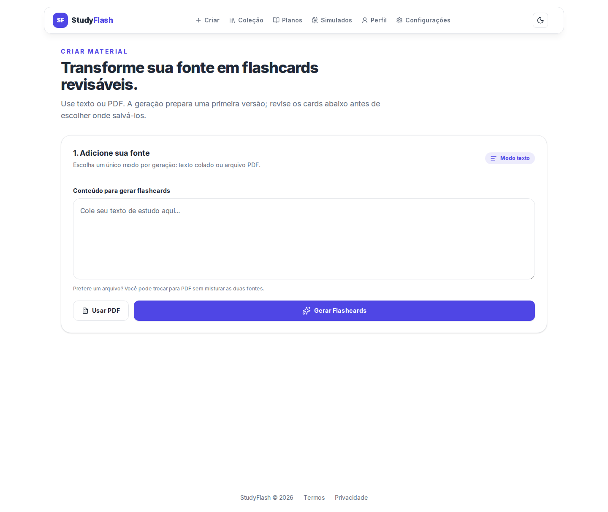
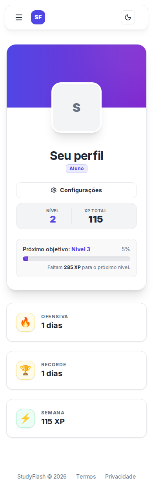
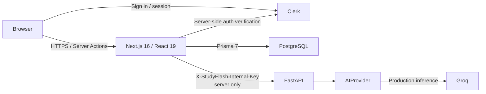

<div align="center">

# StudyFlash

**AI-assisted study engineered for correctness under retries and failure.**

StudyFlash turns study material into flashcards, resumable review sessions, study plans, and server-authoritative practice exams while keeping remote AI behind a server-only boundary and critical correctness guarantees independent from live model availability.

<strong>English</strong> · <a href="docs/i18n/pt-BR/README.md">Português</a> · <a href="docs/i18n/ja/README.md">日本語</a> · <a href="docs/i18n/es/README.md">Español</a>

[](https://github.com/Gyliardson/studyflash-ai/actions/workflows/ci.yml?query=branch%3Aportfolio%2Frevamp-2026)
[](https://github.com/Gyliardson/studyflash-ai/actions/workflows/clean-room.yml?query=branch%3Aportfolio%2Frevamp-2026)
[](LICENSE)

</div>

## Overview

StudyFlash is a Next.js and FastAPI study platform backed by Clerk authentication and PostgreSQL/Prisma persistence. AI assists bounded content-generation flows, while authentication, ownership, persistence, scoring, XP/streak updates, retries, study-session state, and PWA behavior remain ordinary application logic with deterministic verification.

The repository favors narrow, testable claims over broad AI or reliability promises. Remote model output is validated before acceptance, ambiguous mutations are recovered through durable server state where implemented, and critical CI does not depend on a live LLM.

## Why StudyFlash?

| AI-assisted learning | Correctness under retry/failure | Deterministic assurance |
| --- | --- | --- |
| Generate flashcards, plans, topic cards, and exam alternatives through a bounded server-side provider abstraction. | Durable mutation receipts, resumable study sessions, server-authoritative exams, and owner-scoped persistence protect supported flows from duplicate or forged effects. | Scripted AI providers, disposable PostgreSQL, browser tests, accessibility gates, and clean-room verification exercise critical contracts without requiring remote model success. |

## Core capabilities

- Generate flashcards from text and from bounded text extracted from uploaded PDFs.
- Organize cards into decks, study plans, and plan topics.
- Run spaced-review sessions that can resume from persisted server state.
- Create practice exams with persisted server-side question snapshots and canonical server scoring.
- Recover supported content-creation flows after ambiguous responses without duplicating the committed database effect or creation XP.
- Track XP, streaks, levels, and review progress with explicit calendar rules.
- Authenticate with Clerk and enforce user ownership across PostgreSQL-backed application data.
- Install as a PWA with cached static assets and a deliberately network-authoritative protected-data policy.
- Exercise desktop/mobile flows with Playwright and serious/critical accessibility checks.

## Product preview

These are real StudyFlash application states captured by authenticated synthetic Playwright fixtures, not mockups or production-user screenshots. The durable files below are byte-for-byte PNG copies from Browser E2E #405 at exact source SHA `0fdda9a71a9c23ec77d63d4ce31c195ef9605c95`; they are visual portfolio evidence for that capture source, not merge evidence for the current head. See [media provenance](docs/operations/MEDIA.md) for source artifact identity, dimensions, hashes, and validation.

### Create flashcards — desktop

[](docs/media/create-flashcards-desktop-light.png)

### Profile — mobile

<p align="center">
  <a href="docs/media/profile-mobile-light.png">
    
  </a>
</p>

## Architecture



The browser does not receive `GROQ_API_KEY`, `CLERK_SECRET_KEY`, or `STUDYFLASH_INTERNAL_API_KEY`, and it does not call the FastAPI AI service directly. `DATABASE_URL` is server-side; production targets Neon PostgreSQL, while local verification and CI use ordinary disposable PostgreSQL.

## Technical highlights

- **Server-only AI credential boundary.** Next.js is the browser-facing application boundary; the internal FastAPI credential and Groq credential remain server-side.
- **Deterministic AI test provider.** Critical AI behavior is tested with injected scripted providers rather than a live Groq request.
- **Resumable study.** Persisted study sessions and per-card commit state allow supported review sessions to recover from interruption without treating the browser as authoritative state.
- **Server-authoritative exams.** Attempts snapshot questions, expected answers, and options server-side; the browser submits selections, not trusted score/correctness fields.
- **Idempotent exam finalization.** A completed owned attempt resolves to its canonical persisted `ExamSession`; retries cannot grant exam XP twice or rewrite the completed result.
- **Retry-safe content creation.** Durable `MutationReceipt` records converge supported ambiguous create/save retries on one committed database effect. Concurrent first AI-backed requests may still perform duplicate remote inference; the guarantee applies to persisted effects, not exactly-once provider calls.
- **Owner-scoped database access.** User identity is attached to stored entities and database helpers/tests reject cross-user deck, topic, card, study, and exam relationships.
- **PWA network-authoritative semantics.** Static assets may be cached, but authenticated HTML/data and mutations are not treated as offline-authoritative or silently queued by the service worker.
- **Clean-room validation.** A fresh checkout boots the locked backend/frontend dependency graphs, applies migrations to empty PostgreSQL, builds production Next.js, starts FastAPI, and runs the deterministic browser/test matrix with development or synthetic infrastructure.

## AI & privacy boundary

Production inference uses **Groq** behind `app.ai_provider.AIProvider`. Depending on the feature, source text, bounded text extracted from PDFs, plan/topic labels, or an existing flashcard question and correct answer can be sent for inference. Raw PDF binaries are processed by FastAPI and are not sent to Groq by the current implementation.

AI output is not authoritative factual truth. Structured output is schema/domain-validated before acceptance, and provider failures have bounded application semantics. Repository code does **not** prove provider-side zero retention, zero logging, or model-training guarantees. See [AI provider boundary](docs/architecture/AI.md) and [AI failure policy](docs/correctness/AI_FAILURE_POLICY.md).

## Quick Start

### Requirements

- Node.js **22**
- Python **3.12**
- PostgreSQL **16-compatible** database
- Clerk **development** project for authenticated local/browser flows

Use development/synthetic credentials only. Do not use production Clerk, Neon, or AI secrets in tests.

### Backend

```bash
python -m venv .venv
# Linux/macOS: source .venv/bin/activate
# Windows PowerShell: .venv\Scripts\Activate.ps1
pip install -r requirements.txt
cp .env.example .env
uvicorn app.main:app --reload --port 8000
```

The root [`.env.example`](.env.example) documents the FastAPI/Groq boundary. `GROQ_API_KEY` and `STUDYFLASH_INTERNAL_API_KEY` are server-only.

### Frontend and database

```bash
cd frontend
npm ci
cp .env.example .env.local
npx prisma generate
npm run db:migrate:deploy
npm run db:migrate:status
npm run db:schema:verify
npm run dev
```

The frontend [`frontend/.env.example`](frontend/.env.example) documents PostgreSQL, Clerk, and server-only FastAPI configuration. Never prefix `AI_API_URL` or `STUDYFLASH_INTERNAL_API_KEY` with `NEXT_PUBLIC_`.

For the reproducible candidate bootstrap, use the [clean-room runbook](docs/operations/CLEAN_ROOM.md).

## Quality & assurance

Repository verification covers backend syntax/tests, frontend lint/typecheck/build, dependency policy, PostgreSQL ownership and gamification behavior, resumable study integrity, Browser E2E, accessibility, secret scanning, PWA contracts, and clean-room bootstrap. Critical AI verification uses deterministic providers and fixtures rather than live-provider success.

Merge/release evidence belongs to the **exact candidate SHA**. A moved head invalidates evidence from the previous SHA, and clean-room success is evidence rather than automatic merge authorization. Current promotion and required-check policy is documented in [Repository governance](docs/assurance/GOVERNANCE.md).

Representative local checks:

```bash
# repository root
python -m compileall -q app tests
python -m unittest discover -s tests -p 'test_*.py' -v

# frontend/
npm run lint
npx tsc --noEmit
npm run build
npm run db:migrate:status
npm run db:schema:verify
```

## Documentation

[Technical documentation](docs/README.md) is organized by architecture, correctness contracts, operations, assurance, and localized landing pages.

Useful entry points:

- [AI provider and data boundary](docs/architecture/AI.md)
- [Database and migration policy](docs/architecture/DATABASE.md)
- [PWA / offline contract](docs/architecture/PWA_OFFLINE_CONTRACT.md)
- [AI failure policy](docs/correctness/AI_FAILURE_POLICY.md)
- [Content-creation idempotency](docs/correctness/CONTENT_CREATION_IDEMPOTENCY.md)
- [Exam integrity](docs/correctness/EXAM_INTEGRITY.md)
- [Clean-room verification](docs/operations/CLEAN_ROOM.md)
- [Deployment runbook](docs/operations/DEPLOY.md)
- [Media provenance and capture policy](docs/operations/MEDIA.md)
- [Dependency verification](docs/assurance/DEPENDENCIES.md)
- [Repository governance](docs/assurance/GOVERNANCE.md)
- [Security policy](SECURITY.md)

## Limitations

- StudyFlash uses remote Groq inference in production; it does not implement local LLM inference, Ollama, RAG, embeddings, vector retrieval, fine-tuning, or multi-provider routing.
- Generated content can be incomplete or incorrect and is not represented as factual authority.
- The installable PWA is **not** an offline-first data application. Protected reads and writes remain network-authoritative, and the service worker does not provide an offline write queue.
- The local exam-option fallback uses existing flashcard content and may use randomized selection/shuffling; it is not a deterministic runtime AI replacement.
- AI-backed plan/topic retries can duplicate the remote inference call during a concurrent first attempt even though only one supported database effect may commit.
- Calendar-day gamification currently uses the fixed `America/Sao_Paulo` timezone because no per-user timezone preference is persisted.
- CI proves repository contracts against disposable/development infrastructure; it does not prove live production Neon, Clerk, Groq, hosting, or domain configuration.
- Portfolio screenshots document the cited synthetic Browser E2E capture SHA; they do not prove current live hosting, production configuration, or production-user state.

## License

StudyFlash is publicly visible for portfolio, evaluation, educational review, and transparency purposes, but it is **not open source**. The repository is distributed under the proprietary terms in [LICENSE](LICENSE). No permission to use, copy, modify, distribute, sublicense, sell, commercially exploit, or create derivative works is granted except with prior express written permission from the copyright holder. Third-party components retain their own licenses.

## Author

**Gyliardson Keitison** · [GitHub](https://github.com/Gyliardson) · [LinkedIn](https://www.linkedin.com/in/gyliardson-keitison)
