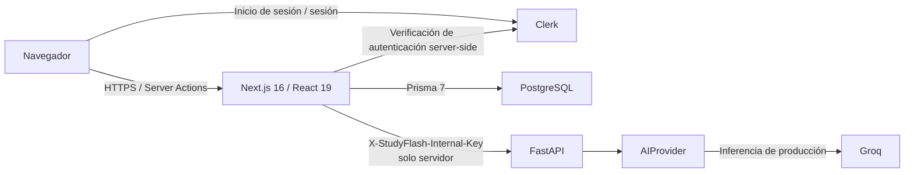

<div align="center">

# StudyFlash

**Estudio asistido por IA, diseñado para preservar la corrección ante reintentos y fallos.**

StudyFlash transforma material de estudio en flashcards, sesiones de repaso reanudables, planes de estudio y simulacros con autoridad en el servidor, manteniendo la IA remota detrás de una frontera exclusivamente server-side y las garantías críticas de corrección independientes de la disponibilidad de un modelo en vivo.

[English](../../../README.md) · [Português](../pt-BR/README.md) · [日本語](../ja/README.md) · [Español](README.md)

[](https://github.com/Gyliardson/studyflash-ai/actions/workflows/ci.yml)
[](https://github.com/Gyliardson/studyflash-ai/actions/workflows/clean-room.yml)
[](../../../LICENSE)

</div>

## Descripción general

StudyFlash es una plataforma de estudio en Next.js y FastAPI con autenticación Clerk y persistencia PostgreSQL/Prisma. La IA asiste flujos limitados de generación de contenido, mientras que autenticación, propiedad, persistencia, puntuación, actualizaciones de XP/racha, reintentos, estado de sesiones de estudio y comportamiento PWA siguen siendo lógica tradicional de la aplicación con verificación determinista.

El repositorio prioriza afirmaciones acotadas y comprobables frente a promesas amplias sobre IA o fiabilidad. La salida del modelo remoto se valida antes de aceptarse, las mutaciones con resultado ambiguo se recuperan mediante estado durable del servidor donde ese contrato está implementado, y el CI crítico no depende de un LLM en vivo.

## ¿Por qué StudyFlash?

| Aprendizaje asistido por IA | Corrección ante reintentos/fallos | Garantía determinista |
| --- | --- | --- |
| Genera flashcards, planes, tarjetas de temas y alternativas de simulacro mediante una abstracción acotada de proveedor ejecutada en el servidor. | Recibos durables de mutación, sesiones de estudio reanudables, simulacros con autoridad en el servidor y persistencia acotada al propietario protegen los flujos soportados de efectos duplicados o falsificados. | Proveedores de IA programados, PostgreSQL desechable, pruebas de navegador, gates de accesibilidad y validación clean-room ejercitan contratos críticos sin requerir éxito de un modelo remoto. |

## Capacidades principales

- Generar flashcards desde texto y desde texto acotado extraído de PDFs subidos.
- Organizar tarjetas en decks, planes de estudio y temas de planes.
- Ejecutar sesiones de repetición espaciada que pueden reanudarse desde estado persistido en el servidor.
- Crear simulacros con snapshots de preguntas persistidos en el servidor y puntuación canónica calculada por el servidor.
- Recuperar flujos soportados de creación de contenido después de respuestas ambiguas sin duplicar el efecto confirmado en la base de datos ni el XP de creación.
- Registrar XP, rachas, niveles y progreso de repaso con reglas explícitas de calendario.
- Autenticar con Clerk y aplicar propiedad por usuario sobre los datos de aplicación respaldados por PostgreSQL.
- Instalar como PWA con assets estáticos en caché y una política deliberadamente network-authoritative para datos protegidos.
- Ejercitar flujos desktop/mobile con Playwright y controles de accesibilidad serious/critical.

## Arquitectura



El navegador no recibe `GROQ_API_KEY`, `CLERK_SECRET_KEY` ni `STUDYFLASH_INTERNAL_API_KEY`, y no llama directamente al servicio de IA FastAPI. `DATABASE_URL` es server-side; producción apunta a Neon PostgreSQL, mientras que la validación local y el CI utilizan PostgreSQL desechable ordinario.

## Aspectos técnicos destacados

- **Frontera server-only para credenciales de IA.** Next.js es la frontera de aplicación expuesta al navegador; la credencial interna de FastAPI y la credencial de Groq permanecen en el servidor.
- **Proveedor determinista de IA para pruebas.** El comportamiento crítico de IA se prueba con proveedores programados inyectados y no con una solicitud Groq en vivo.
- **Estudio reanudable.** Las sesiones persistidas y el estado de commit por tarjeta permiten recuperar sesiones de repaso soportadas tras una interrupción sin tratar al navegador como estado autoritativo.
- **Simulacros con autoridad en el servidor.** Los intentos guardan snapshots de preguntas, respuestas esperadas y opciones en el servidor; el navegador envía selecciones, no campos confiables de puntuación/corrección.
- **Finalización idempotente de simulacros.** Un intento completado y perteneciente al usuario se resuelve al `ExamSession` canónico persistido; los reintentos no pueden otorgar XP del simulacro dos veces ni reescribir el resultado completado.
- **Creación de contenido segura ante reintentos.** Un `MutationReceipt` durable hace que los reintentos ambiguos soportados converjan en un único efecto persistido. Las primeras solicitudes concurrentes respaldadas por IA todavía pueden ejecutar inferencia remota duplicada; la garantía se aplica a efectos persistidos, no a llamadas exactly-once al proveedor.
- **Acceso a base de datos acotado al propietario.** La identidad del usuario acompaña a las entidades almacenadas y los helpers/pruebas de base de datos rechazan relaciones cross-user entre deck, tema, tarjeta, estudio y simulacro.
- **Semántica PWA network-authoritative.** Los assets estáticos pueden almacenarse en caché, pero HTML/datos autenticados y mutaciones no se tratan como autoridad offline ni se encolan silenciosamente mediante el service worker.
- **Validación clean-room.** Un checkout nuevo instala los grafos bloqueados de dependencias backend/frontend, aplica migrations sobre PostgreSQL vacío, compila Next.js de producción, inicia FastAPI y ejecuta la matriz determinista de pruebas/navegador con infraestructura de desarrollo o sintética.

## Frontera de IA y privacidad

La inferencia de producción usa **Groq** detrás de `app.ai_provider.AIProvider`. Según la funcionalidad, el texto fuente, texto acotado extraído de PDFs, etiquetas de plan/tema o la pregunta y respuesta correcta de una flashcard existente pueden enviarse para inferencia. Los binarios PDF sin procesar son tratados por FastAPI y no se envían a Groq en la implementación actual.

La salida de IA no es verdad factual autoritativa. La salida estructurada se valida contra schema/dominio antes de aceptarse, y los fallos del proveedor tienen semántica acotada en la aplicación. El código del repositorio **no** demuestra retención cero del proveedor, logging cero ni garantías sobre entrenamiento de modelos. Consulta [Frontera del proveedor de IA](../../architecture/AI.md) y [Política de fallos de IA](../../correctness/AI_FAILURE_POLICY.md).

## Inicio rápido

### Requisitos

- Node.js **22**
- Python **3.12**
- base de datos compatible con PostgreSQL **16**
- proyecto Clerk de **desarrollo** para flujos locales/autenticados en navegador

Usa únicamente credenciales de desarrollo/sintéticas. No uses secretos de Clerk, Neon o IA de producción en pruebas.

### Backend

```bash
python -m venv .venv
# Linux/macOS: source .venv/bin/activate
# Windows PowerShell: .venv\Scripts\Activate.ps1
pip install -r requirements.txt
cp .env.example .env
uvicorn app.main:app --reload --port 8000
```

El [`.env.example`](../../../.env.example) de la raíz documenta la frontera FastAPI/Groq. `GROQ_API_KEY` y `STUDYFLASH_INTERNAL_API_KEY` son exclusivamente server-side.

### Frontend y base de datos

```bash
cd frontend
npm ci
cp .env.example .env.local
npx prisma generate
npm run db:migrate:deploy
npm run db:migrate:status
npm run db:schema:verify
npm run dev
```

El [`frontend/.env.example`](../../../frontend/.env.example) documenta PostgreSQL, Clerk y la configuración server-only de FastAPI. Nunca prefijes `AI_API_URL` ni `STUDYFLASH_INTERNAL_API_KEY` con `NEXT_PUBLIC_`.

Para el bootstrap reproducible de un candidato, consulta el [runbook clean-room](../../operations/CLEAN_ROOM.md).

## Calidad y assurance

La verificación del repositorio cubre sintaxis/pruebas del backend, lint/typecheck/build del frontend, política de dependencias, propiedad y gamificación en PostgreSQL, integridad del estudio reanudable, Browser E2E, accesibilidad, secret scanning, contratos PWA y bootstrap clean-room. La verificación crítica de IA utiliza proveedores y fixtures deterministas en lugar del éxito de un proveedor en vivo.

La evidencia de merge/release pertenece al **SHA exacto del candidato**. Un cambio del head invalida la evidencia del SHA anterior, y el éxito del clean-room es evidencia, no autorización automática de merge. La política actual de promoción y checks obligatorios está documentada en [Gobernanza del repositorio](../../assurance/GOVERNANCE.md).

Comprobaciones locales representativas:

```bash
# raíz del repositorio
python -m compileall -q app tests
python -m unittest discover -s tests -p 'test_*.py' -v

# frontend/
npm run lint
npx tsc --noEmit
npm run build
npm run db:migrate:status
npm run db:schema:verify
```

## Documentación

La [documentación técnica](../../README.md) está organizada por arquitectura, contratos de corrección, operaciones, assurance y landing pages localizadas.

Puntos de entrada útiles:

- [Proveedor de IA y frontera de datos](../../architecture/AI.md)
- [Política de base de datos y migrations](../../architecture/DATABASE.md)
- [Contrato PWA / offline](../../architecture/PWA_OFFLINE_CONTRACT.md)
- [Política de fallos de IA](../../correctness/AI_FAILURE_POLICY.md)
- [Idempotencia de creación de contenido](../../correctness/CONTENT_CREATION_IDEMPOTENCY.md)
- [Integridad de simulacros](../../correctness/EXAM_INTEGRITY.md)
- [Validación clean-room](../../operations/CLEAN_ROOM.md)
- [Runbook de despliegue](../../operations/DEPLOY.md)
- [Verificación de dependencias](../../assurance/DEPENDENCIES.md)
- [Gobernanza del repositorio](../../assurance/GOVERNANCE.md)
- [Política de seguridad](../../../SECURITY.md)

## Limitaciones

- StudyFlash usa inferencia remota de Groq en producción; no implementa inferencia LLM local, Ollama, RAG, embeddings, recuperación vectorial, fine-tuning ni enrutamiento multi-provider.
- El contenido generado puede ser incompleto o incorrecto y no se presenta como autoridad factual.
- La PWA instalable **no** es una aplicación de datos offline-first. Las lecturas y escrituras protegidas siguen siendo network-authoritative, y el service worker no proporciona una cola de escritura offline.
- El fallback local de opciones del simulacro usa contenido de flashcards existentes y puede emplear selección/barajado aleatorios; no es un sustituto determinista de IA en runtime.
- Los reintentos respaldados por IA para planes/temas pueden duplicar la llamada de inferencia remota durante un primer intento concurrente, aunque solo un efecto soportado en la base de datos puede confirmarse.
- Las reglas de gamificación por día usan actualmente el timezone fijo `America/Sao_Paulo`, porque no se persiste una preferencia de timezone por usuario.
- El CI demuestra contratos del repositorio contra infraestructura desechable/de desarrollo; no demuestra la configuración real de Neon, Clerk, Groq, hosting o dominio en producción.
- Las capturas curadas de portafolio no se incrustan aquí mientras los artefactos de medios actuales del repositorio esperan un reemplazo validado.

## Licencia

StudyFlash es públicamente visible para portafolio, evaluación, revisión educativa y transparencia, pero **no es open source**. El repositorio se distribuye bajo los términos propietarios de [LICENSE](../../../LICENSE). No se concede permiso para usar, copiar, modificar, distribuir, sublicenciar, vender, explotar comercialmente ni crear obras derivadas, salvo autorización previa, expresa y por escrito del titular de los derechos de autor. Los componentes de terceros conservan sus propias licencias.

## Autor

**Gyliardson Keitison** · [GitHub](https://github.com/Gyliardson) · [LinkedIn](https://www.linkedin.com/in/gyliardson-keitison)
