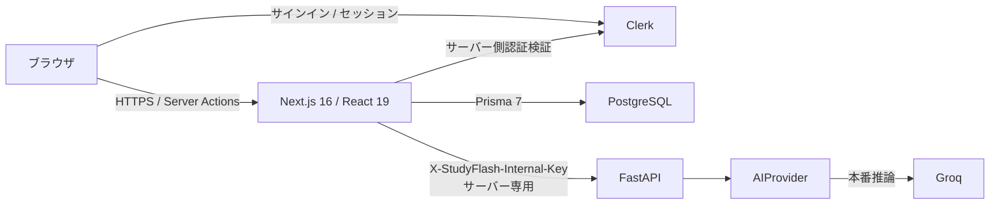

<div align="center">

# StudyFlash

**リトライや障害時の正しさを重視して設計された、AI支援型学習アプリ。**

StudyFlash は学習素材からフラッシュカード、再開可能な復習セッション、学習プラン、サーバー権威型の模擬試験を作成します。リモート AI はサーバー専用の境界の内側に置かれ、重要な正しさの保証はライブモデルの可用性に依存しません。

[English](../../../README.md) · [Português](../pt-BR/README.md) · [日本語](README.md) · [Español](../es/README.md)

[](https://github.com/Gyliardson/studyflash-ai/actions/workflows/ci.yml)
[](https://github.com/Gyliardson/studyflash-ai/actions/workflows/clean-room.yml)
[](../../../LICENSE)

</div>

## 概要

StudyFlash は Next.js と FastAPI で構成され、Clerk 認証と PostgreSQL/Prisma 永続化を利用する学習プラットフォームです。AI は限定されたコンテンツ生成フローを支援しますが、認証、所有権、永続化、採点、XP/ストリーク更新、リトライ、学習セッション状態、PWA の挙動は通常のアプリケーションロジックとして実装され、決定論的に検証されます。

このリポジトリは、AI や信頼性について広い保証をするのではなく、狭く検証可能な保証を優先します。リモートモデルの出力は受理前に検証され、結果が曖昧なミューテーションは、その契約が実装されている範囲で耐久的なサーバー状態から回復されます。また、重要な CI はライブ LLM に依存しません。

## StudyFlash を選ぶ理由

| AI 支援学習 | リトライ・障害時の正しさ | 決定論的な保証 |
| --- | --- | --- |
| サーバー側の限定されたプロバイダー抽象化を通じて、フラッシュカード、学習プラン、トピックカード、模擬試験の選択肢を生成します。 | 耐久的なミューテーションレシート、再開可能な学習セッション、サーバー権威型試験、所有者スコープの永続化により、対応フローで重複・偽造された効果を防ぎます。 | スクリプト化された AI プロバイダー、使い捨て PostgreSQL、ブラウザテスト、アクセシビリティゲート、クリーンルーム検証により、リモートモデルの成功を必要とせず重要な契約を検証します。 |

## 主な機能

- テキスト、およびアップロードされた PDF から抽出した上限付きテキストからフラッシュカードを生成。
- カードをデッキ、学習プラン、プラン内トピックに整理。
- 永続化されたサーバー状態から再開できる間隔反復セッション。
- サーバー側に問題スナップショットを保存し、サーバーが正規の採点を行う模擬試験。
- 対応するコンテンツ作成フローで応答結果が曖昧になっても、確定済み DB 効果や作成 XP を重複させずに回復。
- 明示的なカレンダールールに基づく XP、ストリーク、レベル、復習進捗の追跡。
- Clerk 認証と PostgreSQL 上のアプリケーションデータに対するユーザー所有権の強制。
- 静的アセットをキャッシュし、保護データには意図的にネットワーク権威型ポリシーを適用するインストール可能 PWA。
- Playwright によるデスクトップ/モバイルフローと serious/critical アクセシビリティ検査。

## アーキテクチャ



ブラウザには `GROQ_API_KEY`、`CLERK_SECRET_KEY`、`STUDYFLASH_INTERNAL_API_KEY` は渡されず、FastAPI の AI サービスを直接呼び出しません。`DATABASE_URL` もサーバー側です。本番 DB の対象は Neon PostgreSQL で、ローカル検証と CI では通常の使い捨て PostgreSQL を使用します。

## 技術的ハイライト

- **AI 認証情報のサーバー専用境界。** Next.js がブラウザ向けアプリケーション境界であり、FastAPI 内部認証情報と Groq 認証情報はサーバー側に保持されます。
- **決定論的 AI テストプロバイダー。** 重要な AI 挙動は、ライブ Groq リクエストではなく、注入されたスクリプト化プロバイダーで検証されます。
- **再開可能な学習。** 永続化された学習セッションとカード単位のコミット状態により、ブラウザを権威状態とせずに対応する復習セッションを中断から回復できます。
- **サーバー権威型の試験。** 試行では問題、期待回答、選択肢をサーバー側にスナップショットし、ブラウザは選択結果のみを送信します。採点や正誤フラグを信頼入力として扱いません。
- **冪等な試験確定。** 完了済みで所有者が一致する試行は、永続化された正規の `ExamSession` に解決されます。リトライで試験 XP が二重付与されたり、完了済み結果が書き換えられたりしません。
- **リトライ安全なコンテンツ作成。** 耐久的な `MutationReceipt` により、対応する曖昧な作成/保存リトライは 1 つの確定済み DB 効果へ収束します。ただし AI を使う最初の同時リクエストでは、リモート推論が重複して実行される可能性があります。保証対象は永続化効果であり、プロバイダー呼び出しの exactly-once ではありません。
- **所有者スコープの DB アクセス。** 保存エンティティにはユーザー ID が結び付けられ、DB ヘルパーとテストはデッキ、トピック、カード、学習、試験のユーザー間参照を拒否します。
- **PWA のネットワーク権威型セマンティクス。** 静的アセットはキャッシュできますが、認証済み HTML/データやミューテーションをオフラインの権威状態として扱わず、Service Worker が書き込みを黙ってキューイングすることもありません。
- **クリーンルーム検証。** 新規 checkout からロックされた backend/frontend 依存関係を導入し、空の PostgreSQL に migrations を適用し、本番 Next.js をビルドし、FastAPI を起動し、開発用または合成インフラで決定論的なテスト/ブラウザマトリクスを実行します。

## AI とプライバシーの境界

本番推論は `app.ai_provider.AIProvider` の背後で **Groq** を利用します。機能に応じて、元の学習テキスト、PDF から抽出された上限付きテキスト、プラン/トピック名、または既存フラッシュカードの質問と正解が推論のため送信される場合があります。現在の実装では PDF の生バイナリは FastAPI が処理し、Groq には送信しません。

AI 出力は権威的な事実ではありません。構造化出力は受理前に schema/domain 検証され、プロバイダー障害には上限付きのアプリケーションセマンティクスがあります。このリポジトリのコードは、プロバイダー側の Zero Data Retention、ゼロログ、モデル学習に関する保証を**証明しません**。詳細は [AI プロバイダー境界](../../architecture/AI.md) と [AI 障害ポリシー](../../correctness/AI_FAILURE_POLICY.md) を参照してください。

## クイックスタート

### 必要環境

- Node.js **22**
- Python **3.12**
- PostgreSQL **16 互換**データベース
- ローカル/ブラウザ認証フロー用の Clerk **development** プロジェクト

開発用または合成の認証情報のみを使用してください。テストで本番 Clerk、Neon、AI のシークレットを使用しないでください。

### Backend

```bash
python -m venv .venv
# Linux/macOS: source .venv/bin/activate
# Windows PowerShell: .venv\Scripts\Activate.ps1
pip install -r requirements.txt
cp .env.example .env
uvicorn app.main:app --reload --port 8000
```

ルートの [`.env.example`](../../../.env.example) が FastAPI/Groq 境界を定義します。`GROQ_API_KEY` と `STUDYFLASH_INTERNAL_API_KEY` はサーバー専用です。

### Frontend とデータベース

```bash
cd frontend
npm ci
cp .env.example .env.local
npx prisma generate
npm run db:migrate:deploy
npm run db:migrate:status
npm run db:schema:verify
npm run dev
```

[`frontend/.env.example`](../../../frontend/.env.example) に PostgreSQL、Clerk、サーバー専用 FastAPI 設定があります。`AI_API_URL` または `STUDYFLASH_INTERNAL_API_KEY` に `NEXT_PUBLIC_` を付けないでください。

再現可能な候補 bootstrap については [クリーンルーム runbook](../../operations/CLEAN_ROOM.md) を参照してください。

## 品質と保証

リポジトリ検証は backend の構文/テスト、frontend の lint/typecheck/build、依存関係ポリシー、PostgreSQL の所有権と gamification、再開可能学習の整合性、Browser E2E、アクセシビリティ、secret scanning、PWA 契約、clean-room bootstrap を対象とします。重要な AI 検証ではライブプロバイダーの成功ではなく、決定論的プロバイダーと fixtures を使用します。

merge/release の証拠は **候補の正確な SHA** に紐付きます。head が移動した場合、以前の SHA の証拠は無効になります。また clean-room 成功は証拠であって、自動的な merge 許可ではありません。現在の promotion と required-check ポリシーは [リポジトリガバナンス](../../assurance/GOVERNANCE.md) に記載されています。

代表的なローカルチェック:

```bash
# リポジトリルート
python -m compileall -q app tests
python -m unittest discover -s tests -p 'test_*.py' -v

# frontend/
npm run lint
npx tsc --noEmit
npm run build
npm run db:migrate:status
npm run db:schema:verify
```

## ドキュメント

[技術ドキュメント](../../README.md) は architecture、correctness contracts、operations、assurance、ローカライズされた landing page に整理されています。

主な入口:

- [AI プロバイダーとデータ境界](../../architecture/AI.md)
- [DB と migration ポリシー](../../architecture/DATABASE.md)
- [PWA / offline 契約](../../architecture/PWA_OFFLINE_CONTRACT.md)
- [AI 障害ポリシー](../../correctness/AI_FAILURE_POLICY.md)
- [コンテンツ作成の冪等性](../../correctness/CONTENT_CREATION_IDEMPOTENCY.md)
- [試験整合性](../../correctness/EXAM_INTEGRITY.md)
- [Clean-room 検証](../../operations/CLEAN_ROOM.md)
- [Deploy runbook](../../operations/DEPLOY.md)
- [依存関係検証](../../assurance/DEPENDENCIES.md)
- [リポジトリガバナンス](../../assurance/GOVERNANCE.md)
- [セキュリティポリシー](../../../SECURITY.md)

## 制限事項

- StudyFlash は本番でリモート Groq 推論を利用します。ローカル LLM 推論、Ollama、RAG、embeddings、vector retrieval、fine-tuning、multi-provider routing は実装していません。
- 生成コンテンツは不完全または誤っている可能性があり、事実上の権威として扱いません。
- インストール可能 PWA は **offline-first のデータアプリではありません**。保護された読み書きはネットワーク権威型のままで、Service Worker はオフライン書き込みキューを提供しません。
- 模擬試験のローカル選択肢 fallback は既存フラッシュカードの内容を使用し、ランダムな選択/シャッフルを行う場合があります。実行時の決定論的 AI 代替ではありません。
- 学習プラン/トピックの AI リトライでは、最初の同時試行時にリモート推論呼び出しが重複する場合がありますが、対応する DB 効果は 1 つのみ commit できます。
- ユーザーごとの timezone 設定が永続化されていないため、日単位の gamification は現在固定 `America/Sao_Paulo` timezone を使用します。
- CI は使い捨て/開発インフラ上のリポジトリ契約を証明しますが、本番 Neon、Clerk、Groq、hosting、domain 設定を証明しません。
- ルート README のポートフォリオスクリーンショットは、記載された合成 Browser E2E キャプチャ SHA を示すものであり、現在の本番ホスティング、構成、実ユーザーデータの状態を証明するものではありません。出典は [MEDIA.md](../../operations/MEDIA.md) を参照してください。

## ライセンス

StudyFlash はポートフォリオ、評価、教育的レビュー、透明性のため公開されていますが、**オープンソースではありません**。このリポジトリは [LICENSE](../../../LICENSE) のプロプライエタリ条件で提供されます。著作権者から事前の明示的な書面による許可がない限り、本ソフトウェアを使用、複製、改変、配布、サブライセンス、販売、商業利用、派生物作成する許可は付与されません。第三者コンポーネントにはそれぞれのライセンスが適用されます。

## 作者

**Gyliardson Keitison** · [GitHub](https://github.com/Gyliardson) · [LinkedIn](https://www.linkedin.com/in/gyliardson-keitison)
