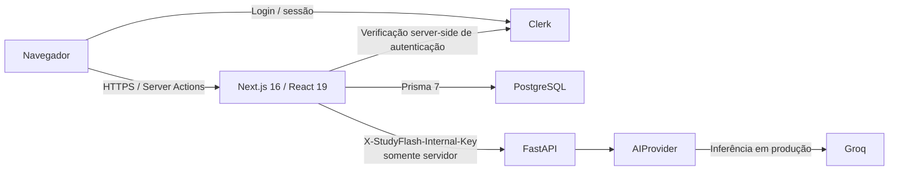

<div align="center">

# StudyFlash

**Estudo assistido por IA, projetado para manter a correção sob retries e falhas.**

O StudyFlash transforma materiais de estudo em flashcards, sessões de revisão retomáveis, planos de estudo e simulados com autoridade no servidor, mantendo a IA remota atrás de uma fronteira exclusivamente server-side e as garantias críticas de correção independentes da disponibilidade de um modelo ao vivo.

[English](../../../README.md) · [Português](README.md) · [日本語](../ja/README.md) · [Español](../es/README.md)

[](https://github.com/Gyliardson/studyflash-ai/actions/workflows/ci.yml)
[](https://github.com/Gyliardson/studyflash-ai/actions/workflows/clean-room.yml)
[](../../../LICENSE)

</div>

## Visão geral

O StudyFlash é uma plataforma de estudos em Next.js e FastAPI, com autenticação Clerk e persistência PostgreSQL/Prisma. A IA auxilia fluxos limitados de geração de conteúdo, enquanto autenticação, propriedade, persistência, pontuação, atualizações de XP/streak, retries, estado de sessões de estudo e comportamento PWA permanecem lógica tradicional da aplicação com verificação determinística.

O repositório prioriza afirmações estreitas e testáveis, em vez de promessas amplas sobre IA ou confiabilidade. A saída do modelo remoto é validada antes de ser aceita, mutações com resultado ambíguo são recuperadas por estado durável no servidor onde esse contrato foi implementado, e o CI crítico não depende de um LLM ao vivo.

## Por que StudyFlash?

| Aprendizado assistido por IA | Correção sob retry/falha | Garantia determinística |
| --- | --- | --- |
| Gere flashcards, planos, cartões de tópicos e alternativas de simulado por uma abstração de provedor limitada e executada no servidor. | Receipts duráveis de mutação, sessões de estudo retomáveis, simulados com autoridade no servidor e persistência escopada ao proprietário protegem os fluxos suportados contra efeitos duplicados ou forjados. | Provedores de IA roteirizados, PostgreSQL descartável, testes de navegador, gates de acessibilidade e validação clean-room exercitam contratos críticos sem exigir sucesso de um modelo remoto. |

## Capacidades principais

- Gerar flashcards a partir de texto e de texto limitado extraído de PDFs enviados.
- Organizar cartões em decks, planos de estudo e tópicos de planos.
- Executar sessões de revisão espaçada que podem ser retomadas a partir de estado persistido no servidor.
- Criar simulados com snapshots de questões persistidos no servidor e pontuação canônica calculada no servidor.
- Recuperar fluxos suportados de criação de conteúdo após respostas ambíguas sem duplicar o efeito confirmado no banco nem o XP de criação.
- Acompanhar XP, streaks, níveis e progresso de revisão com regras explícitas de calendário.
- Autenticar com Clerk e aplicar propriedade por usuário aos dados da aplicação persistidos em PostgreSQL.
- Instalar como PWA com assets estáticos em cache e uma política deliberadamente network-authoritative para dados protegidos.
- Exercitar fluxos desktop/mobile com Playwright e verificações de acessibilidade serious/critical.

## Arquitetura



O navegador não recebe `GROQ_API_KEY`, `CLERK_SECRET_KEY` nem `STUDYFLASH_INTERNAL_API_KEY`, e não chama diretamente o serviço de IA em FastAPI. `DATABASE_URL` é server-side; produção tem Neon PostgreSQL como alvo, enquanto validação local e CI usam PostgreSQL descartável comum.

## Destaques técnicos

- **Fronteira server-only para credenciais de IA.** Next.js é a fronteira da aplicação exposta ao navegador; a credencial interna do FastAPI e a credencial Groq permanecem no servidor.
- **Provedor determinístico de IA para testes.** O comportamento crítico de IA é testado com provedores roteirizados injetados, e não com uma requisição Groq ao vivo.
- **Estudo retomável.** Sessões persistidas e estado de commit por cartão permitem que revisões suportadas se recuperem de interrupções sem tratar o navegador como estado autoritativo.
- **Simulados com autoridade no servidor.** Tentativas mantêm snapshot de questões, respostas esperadas e opções no servidor; o navegador envia seleções, não campos confiáveis de pontuação/correção.
- **Finalização idempotente de simulado.** Uma tentativa concluída e pertencente ao usuário resolve para seu `ExamSession` canônico persistido; retries não podem conceder XP do simulado duas vezes nem reescrever o resultado concluído.
- **Criação de conteúdo segura sob retry.** `MutationReceipt` durável faz retries ambíguos suportados convergirem para um efeito persistido. Primeiras requisições concorrentes com IA ainda podem executar inferência remota duplicada; a garantia se aplica aos efeitos persistidos, não a chamadas exactly-once ao provedor.
- **Acesso ao banco escopado ao proprietário.** A identidade do usuário acompanha entidades persistidas, e helpers/testes de banco rejeitam relações cross-user entre deck, tópico, cartão, estudo e simulado.
- **Semântica PWA network-authoritative.** Assets estáticos podem ser cacheados, mas HTML/dados autenticados e mutações não são tratados como autoritativos offline nem enfileirados silenciosamente pelo service worker.
- **Validação clean-room.** Um checkout novo inicializa os grafos travados de dependências backend/frontend, aplica migrations em PostgreSQL vazio, compila o Next.js de produção, inicia FastAPI e executa a matriz determinística de testes/navegador com infraestrutura de desenvolvimento ou sintética.

## Fronteira de IA e privacidade

A inferência de produção usa **Groq** atrás de `app.ai_provider.AIProvider`. Dependendo do recurso, texto-fonte, texto limitado extraído de PDFs, rótulos de plano/tópico ou a pergunta e resposta correta de um flashcard existente podem ser enviados para inferência. Os binários brutos de PDF são processados pelo FastAPI e não são enviados ao Groq pela implementação atual.

A saída da IA não é verdade factual autoritativa. A saída estruturada passa por validação de schema/domínio antes de ser aceita, e falhas do provedor têm semântica limitada na aplicação. O código do repositório **não** comprova retenção zero no provedor, logging zero ou garantias sobre treinamento de modelos. Veja [Fronteira do provedor de IA](../../architecture/AI.md) e [Política de falhas de IA](../../correctness/AI_FAILURE_POLICY.md).

## Início rápido

### Requisitos

- Node.js **22**
- Python **3.12**
- banco compatível com PostgreSQL **16**
- projeto Clerk de **desenvolvimento** para fluxos locais/autenticados no navegador

Use somente credenciais de desenvolvimento/sintéticas. Não use segredos de Clerk, Neon ou IA de produção em testes.

### Backend

```bash
python -m venv .venv
# Linux/macOS: source .venv/bin/activate
# Windows PowerShell: .venv\Scripts\Activate.ps1
pip install -r requirements.txt
cp .env.example .env
uvicorn app.main:app --reload --port 8000
```

O [`.env.example`](../../../.env.example) da raiz documenta a fronteira FastAPI/Groq. `GROQ_API_KEY` e `STUDYFLASH_INTERNAL_API_KEY` são exclusivamente server-side.

### Frontend e banco de dados

```bash
cd frontend
npm ci
cp .env.example .env.local
npx prisma generate
npm run db:migrate:deploy
npm run db:migrate:status
npm run db:schema:verify
npm run dev
```

O [`frontend/.env.example`](../../../frontend/.env.example) documenta PostgreSQL, Clerk e a configuração server-only do FastAPI. Nunca prefixe `AI_API_URL` ou `STUDYFLASH_INTERNAL_API_KEY` com `NEXT_PUBLIC_`.

Para o bootstrap reproduzível de um candidato, use o [runbook clean-room](../../operations/CLEAN_ROOM.md).

## Qualidade e assurance

A verificação do repositório cobre sintaxe/testes do backend, lint/typecheck/build do frontend, política de dependências, propriedade e gamificação em PostgreSQL, integridade de estudo retomável, Browser E2E, acessibilidade, secret scanning, contratos PWA e bootstrap clean-room. A verificação crítica de IA usa provedores e fixtures determinísticos em vez do sucesso de um provedor ao vivo.

A evidência de merge/release pertence ao **SHA exato do candidato**. Se o head mudar, a evidência do SHA anterior deixa de valer, e sucesso no clean-room é evidência, não autorização automática para merge. A política atual de promoção e checks obrigatórios está em [Governança do repositório](../../assurance/GOVERNANCE.md).

Verificações locais representativas:

```bash
# raiz do repositório
python -m compileall -q app tests
python -m unittest discover -s tests -p 'test_*.py' -v

# frontend/
npm run lint
npx tsc --noEmit
npm run build
npm run db:migrate:status
npm run db:schema:verify
```

## Documentação

A [documentação técnica](../../README.md) é organizada por arquitetura, contratos de correção, operações, assurance e landing pages localizadas.

Entradas úteis:

- [Provedor de IA e fronteira de dados](../../architecture/AI.md)
- [Política de banco e migrations](../../architecture/DATABASE.md)
- [Contrato PWA / offline](../../architecture/PWA_OFFLINE_CONTRACT.md)
- [Política de falhas de IA](../../correctness/AI_FAILURE_POLICY.md)
- [Idempotência na criação de conteúdo](../../correctness/CONTENT_CREATION_IDEMPOTENCY.md)
- [Integridade de simulados](../../correctness/EXAM_INTEGRITY.md)
- [Validação clean-room](../../operations/CLEAN_ROOM.md)
- [Runbook de deploy](../../operations/DEPLOY.md)
- [Verificação de dependências](../../assurance/DEPENDENCIES.md)
- [Governança do repositório](../../assurance/GOVERNANCE.md)
- [Política de segurança](../../../SECURITY.md)

## Limitações

- O StudyFlash usa inferência remota Groq em produção; não implementa inferência LLM local, Ollama, RAG, embeddings, busca vetorial, fine-tuning nem roteamento multi-provider.
- Conteúdo gerado pode estar incompleto ou incorreto e não é apresentado como autoridade factual.
- A PWA instalável **não** é uma aplicação de dados offline-first. Leituras e escritas protegidas permanecem network-authoritative, e o service worker não fornece uma fila de escrita offline.
- O fallback local de opções do simulado usa conteúdo de flashcards existentes e pode usar seleção/embaralhamento aleatórios; não é uma substituição determinística de IA em runtime.
- Retries com IA para planos/tópicos podem duplicar a chamada de inferência remota durante uma primeira tentativa concorrente, embora apenas um efeito suportado no banco possa ser confirmado.
- Regras de gamificação por dia atualmente usam o timezone fixo `America/Sao_Paulo`, pois nenhuma preferência de timezone por usuário é persistida.
- O CI comprova contratos do repositório contra infraestrutura descartável/de desenvolvimento; não comprova configuração real de Neon, Clerk, Groq, hosting ou domínio em produção.
- Os screenshots de portfólio exibidos no README canônico documentam o SHA citado de captura Browser E2E sintética; não comprovam configuração ou estado ao vivo de produção. A proveniência está em [MEDIA.md](../../operations/MEDIA.md).

## Licença

O StudyFlash é publicamente visível para portfólio, avaliação, revisão educacional e transparência, mas **não é open source**. O repositório é distribuído sob os termos proprietários de [LICENSE](../../../LICENSE). Nenhuma permissão para usar, copiar, modificar, distribuir, sublicenciar, vender, explorar comercialmente ou criar obras derivadas é concedida, exceto mediante autorização prévia e expressa por escrito do titular dos direitos autorais. Componentes de terceiros mantêm suas próprias licenças.

## Autor

**Gyliardson Keitison** · [GitHub](https://github.com/Gyliardson) · [LinkedIn](https://www.linkedin.com/in/gyliardson-keitison)
